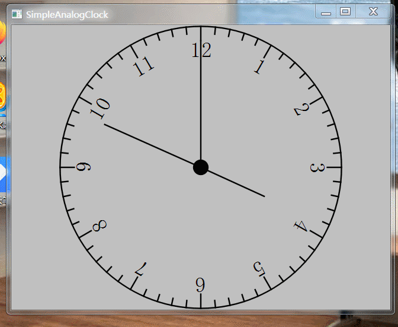
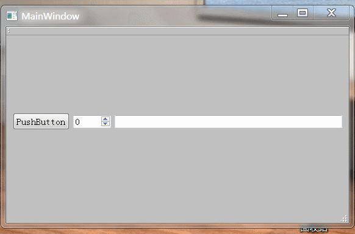
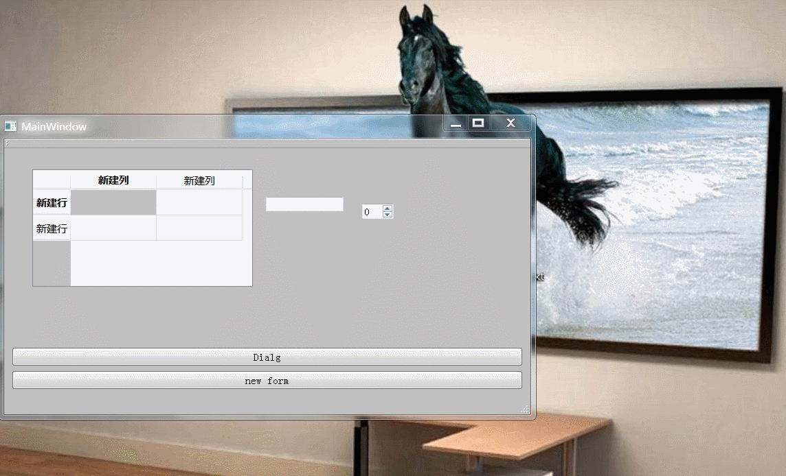
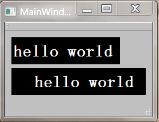
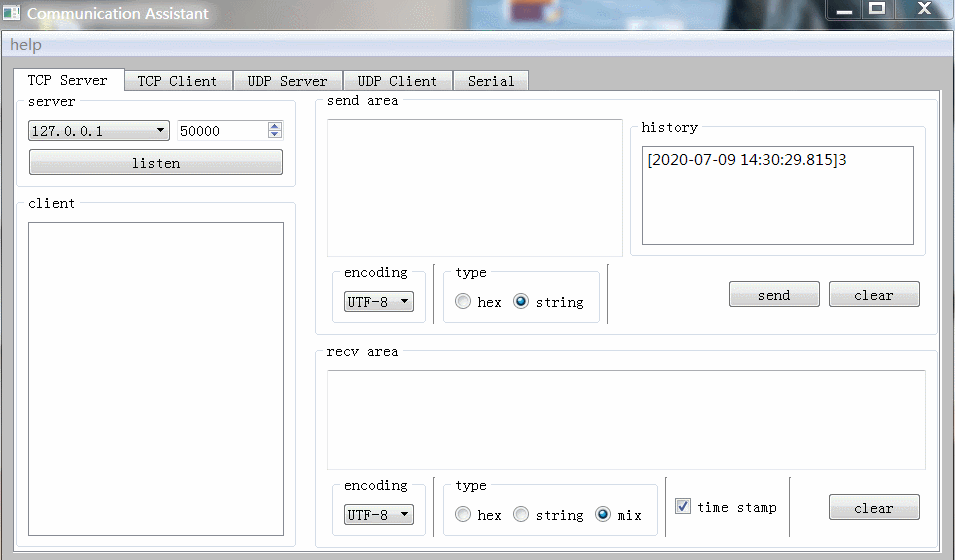
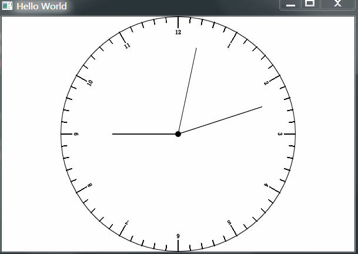
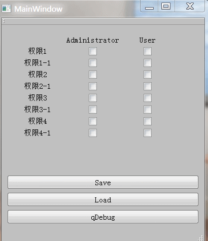
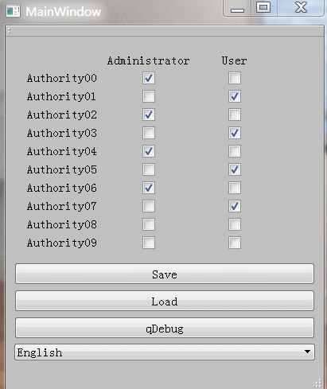
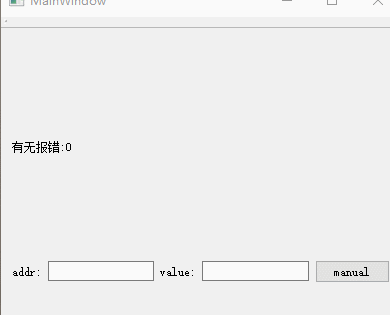
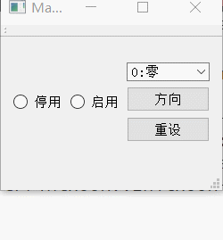

# fuxiruo-and-Qt
Qt小知识小技巧分享

### 目录
| 编号 | 文件夹 | 描述 |
| ------ | ------ | ------ |
| 1 | mapFromGlobal&mapToGlobal | mapFromGlobal&mapToGlobal |
| 2 | KeepRatioQWidget | 控制QWidget的缩放按照minimumWidth和minimumHeight的比例 |
| 3 | SimpleAnalogClock | 简易时钟 |
| 4 | InputHistoryList | 用QListWidget为QSpinBox、QLineEdit添加输入历史选择列表 |
| 5 | myKeyBoard | 软键盘 |
| 6 | myScrollText | 滚动字幕 |
| 7 | CommunicationAssistant | 通信调试助手 |
| 8 | ntpClient | ntp客户端 |
| 9 | testStickyFrame | 适用于解析字符流简单通信协议的帧分割，例如协议格式为CMD:DATA1:DATA2，开头为命令号，接一个:分割符号，然后就是数据。还包含了QtTest基本用法
| 10 | qmlClock | qml中用Canvas做的一个简易时钟 |
| 11 | myAuthority | 简易权限配置控件，用QTranslator实现国际化，QSettings实现ini数据存储和读取 |
| 12 | MessageImage | 图片轮播 |
| 13 | SimpleSelect | QRadioButton封装，动态布局，按钮styleSheet |
| 14 | testQDataStream | QDataStream读写二进制文件,MD5校验 |

### 效果图

